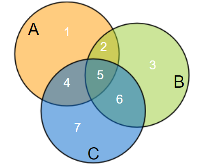
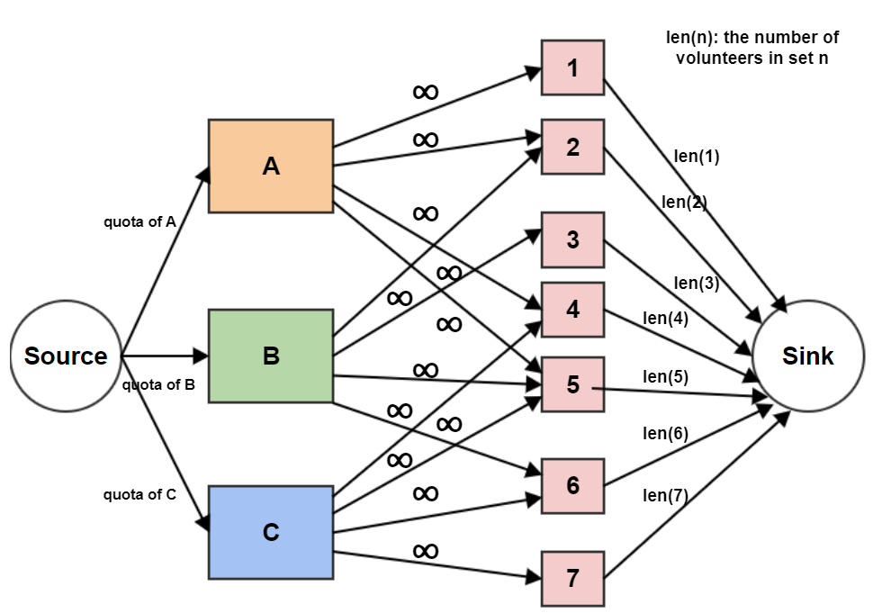

# Description

You are trying to help host the upcoming World Science Fair in your city.

There will be a lot of attendees, and three large gyms will be used for various activities (let us call those gyms A, B, and C).

In order to help organizing the event at each gym, you are trying to assign volunteers to these three gyms -- specifically, up to nA, nB, and nC (respectively) volunteers to gym A, gym B, and gym C (respectively).

One volunteer can be assigned to at most one gym, and volunteers do have preferences over which gym(s) they want to be assigned to.

For instance, suppose n = 4 and nA = nB = nC = 1 (for simplicity, let us label the four volunteers 1, 2, 3, and 4).

Only volunteer 1 wants to be assigned to gym A.
Only volunteer 1 wants to be assigned to gym B.
Both volunteers 2 and 3 want to be assigned to gym C.
Volunteer 4 does not want to be assigned to any gyms (perhaps this volunteer wants to participate in other volunteering opportunities).
In this case, because nC = 1, we must choose either volunteer 2 or volunteer 3 for gym C.

Volunteer 1 can only be assigned to either gym A or gym B.

Therefore, we can assign at most two volunteers to the gyms in this example.

Given n, nA, nB, and nC and the preferences of n volunteers, write a program that computes how to assign maximum number of volunteers to the gyms.

## Input
The first line will contain the number of test cases, T.

For each test case, the first line will contain n and the second line will contain nA, nB, and nC separated by a whitespace.

The following three lines will describe which volunteers want to be assigned to each gym.

The first of the three lines will begin with mA (the number of volunteers who want to be assigned to gym A), followed by mA numbers (representing volunteers who are labeled from 1 to n), separated by a whitespace. Likewise, the second line will contain mB followed by mB numbers, and the third line mC followed by mC numbers.

## Output
For each test case, the first line must contain the maximum number of volunteers you can assign to the three gyms, which we call x.

The next x lines must describe how you assign these x volunteers to gyms.

Each line must contain one of the characters (A, B, or C) and the volunteer's number, separated by a whitespace.

If there are multiple assignments with the same number of assigned volunteers, you may find any one of them.

## Limit
```
1 ≤ T ≤ 10
1 ≤ n ≤ 10,000
1 ≤ nA, nB, nC ≤ n
0 ≤  mA, mB, mC ≤ n
```

## Sample Input
```
3
3
1 1 1
1 1
1 1
2 2 3
4
1 1 1
1 1
1 1
2 2 3
5
1 1 2
1 1
1 5
4 1 2 3 5
```
## Sample Output
```
2
1 A
2 C
2
2 C
1 B
4
1 A
2 C
5 B
3 C
```

# Solution:
It's a matter of finding a way to efficiently distribute resources with limited amounts and uses. Maximum flow algorithm can be applied.



Depending on the laboratory choosen, volunteers can be classified into sets 1-7 as follows.

If you distribute the quota of labs A, B, and C to volunteers belonging to groups 1 to 7, you can configure nodes as shown in the figure below.

Each laboratory connects to a set of volunteers with an edge of infinite capacity to send the flow indefinitely. Even when connected in an infinite capacity, the maximum amount of flow that each laboratory can send is limited by setting the quota of labs on the capacity of the edge from the source to the laboratory.

In addition, the maximum amount of flow that each set of volunteers can receive can also be limited by setting the number of volunteers in each set on the capacity of the edge from the set of volunteers to sink. In this graph, the maximum flow rate maximizes the total number of volunteers that can be assigned. 