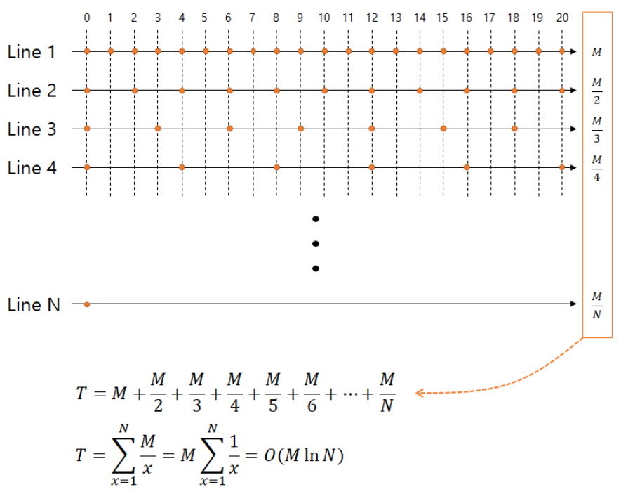
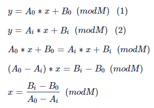

# Description:

Albert has n digital clocks that are numbered from 1 to n, for convenience.

Each clock shows time in the form of "HH:MM:SS" (hour:minute:second) where 0 ≤ HH < 24, 0 ≤ MM < 60, and 0 ≤ SS < 60 are always satisfied. If any of HH, MM, and SS is less than 10, it will show a leading zero -- thus, each clock will always display six digits. For instance, "00:00:01" is 1 second after midnight, "12:00:00" is noon, and "18:05:05" is 5 minutes and 5 seconds after 6 o'clock in the afternoon.


Each clock is currently showing an arbitrary time. And some of them may advance more than a second per each second if they are broken. More formally, let T[i] be the current time shown by the i-th clock and let D[i] be how much the i-th clock advances per each second.

For instance, suppose n = 3, T = [ "11:12:00", "11:12:20", "11:12:40" ], and D = [4, 2, 0].

* Three clocks show different times at the moment.
* 5 seconds from now, clock 1 will display "11:12:20", clock 2 "11:12:30", and clock 3 "11:12:40".
* 10 seconds from now, all three clocks will display "11:12:40" (at this moment, we say the n clocks are "synchronized").
* 43,210 seconds from now, all three clocks will be synchronized again.

In this example, the three clocks are synchronized exactly twice during a 24-hour span.

Albert has the information about the current time displayed by each clock and how much each clock advances each second. Using this, Albert wants to know how many times all n clocks are synchronized in 24 hours (or, in 86,400 seconds).
(See the "Hints" section below.)

## Input
The first line of the input will contain a single number, T, the number of test cases.

Each test case will consist of three lines. The first line will contain n. The second line will contain n strings (T[i]'s) in the form of "HH:MM:SS", separated by whitespace. The third line will contain n integers (D[i]'s), separated by whitespace.

##Output
For each test case, output the answer in a single line.

##Limit
```
1 ≤ T ≤ 20
2 ≤ n ≤ 70,000
T[i] will always be in the form of "HH:MM:SS" such that 0 ≤ HH < 24, 0 ≤ MM < 60, and 0 ≤ SS < 60 (HH, MM, and SS are all integers and will contain a leading zero if their value is less than 10).
-109 ≤ D[i] ≤ 109
Subtask 1 (7 Points)
2 ≤ n ≤ 170
Subtask 2 (19 Points)
2 ≤ n ≤ 70,000
```
##Sample Input 1
```
6
3
11:12:00 11:12:20 11:12:40
4 2 0
2
00:00:00 23:59:59
1 1
2
00:00:00 00:00:00
90000 3600
2
11:00:00 11:00:00
1 -1
3
11:00:00 11:00:00 23:00:00
1 -1 0
3
15:19:59 16:07:49 15:44:54
966 392 667
```
## Sample Output 1
```
2
0
86400
2
1
1
```

Case 1: Discussed in the problem statement.

Case 2: Both clocks advance by 1 second each second, and thus they are never synchronized.

Case 3: Both clocks will always display the same time, and thus they are synchronized 86,400 times during a 24-hour span.

Case 4: These two clocks are synchronized every 12 hours.

Case 5: No explanation provided.

Case 6: No explanation provided.

## Hints
In this problem, you need to count the number of times where n clocks are synchronized during any 24-hour period. If the current time is "0 seconds from now", then you can count the number of synchronizations between 0 seconds from now and 86399 seconds from now, inclusive (see sample cases 3 and 4). Alternatively, you can count the number of synchronizations between 1 seconds from now and 86400 seconds from now, inclusive. Likewise, you can count the number of synchronizations between s seconds from now and (s+86399) seconds from now. Regardless of which method you choose, the answer will be the same.

# Solution: Check that all straight lines go through the same point for each point (24 hours)

Converting the time given in the problem to seconds, the movement of each clock becomes a straight line graph as shown below.
```
y=A∗x+B  (modM)
```

Meaning: y is the number of seconds after x seconds have elapsed.
M: 24 hours * 60 minutes * 60 seconds = 86,400 seconds

Therefore, this problem can be the problem of finding the number of points where N straight lines intersect at the same time.

In a general coordinate plane, the point where two straight lines intersect is at most one point, but two straight lines that intersect once intersect at regular intervals due to modular operation.

There are many ways to solve this problem, but I will introduce two methods.

1. Check that all straight lines go through the same point for each point (24 hours)
2. Check the intersection of all linear equations using Modular Multiplicative Inverse

This method checks that all straight lines pass through the same point y for each point x on the interval [0, 86400).

At first glance, this approach appears to be some kind of brute force, and it seems that it will take too long to solve the problem.

However, if you can filter out the worst case with a little preprocessing, it can be a good enough solution.

Approach 1 solves the problem in two steps.

* Remove duplicate straight lines
* Check if all straight lines go through the same point at each point

1. Step 1) Remove duplicate straight lines - Hash-based struct: O(N), Tree-based struct: O(NlogN)

When all points are checked one by one, the worst case is that all straight lines overlap at all points, and its time complexity is O(MN).

In this case, it means that they are all the same straight line, which can be easily eliminated in the preprocessing process by normalizing A and B to have the range [0, M) in the equation of y = Ax + B.

It also means that the two straight lines do not intersect when A is equal, and that the two lines do not intersect when only B differs at y = Ax + B, so we can solve it easily without the second step.

* Step 2) Check if all straight lines go through the same point at each point - O(MlnN)

After preprocessing, all straight lines are guaranteed to have different slopes.

Now, at each point x, we check in turn if the values from straight line 1 to N are equal.

Perhaps everyone is skeptical of this approach.

However, considering the worst case of the problem after preprocessing, it can be confirmed that it is sufficiently possible.

This approach requires counting every point where Line 1 intersects another line when checking whether it intersects sequentially from line 1 to line N.

Therefore, it can be seen that the case where a straight line is made to intersect the most with straight line 1 is the worst case.

Then, looking at the figure below, let's look at the case of maximally intersecting straight line 1.

Since straight line 1 is straight line 1 itself, a total of M overlaps.

Line 2 is not the same as Line 1 and should intersect as much as possible, so it intersects every 2 times, totaling (M/2).

Line 3 is not the same as Line 1 and Line 2 and should intersect as much as possible, so it intersects every 3 times, totaling (M/3).

...

Therefore, the maximum number of intersections between Line 1 and all straight lines up to N is the sum of the number of intersections with Line 1 of each straight line and becomes MlnN by the following equation.

In conclusion, it can be seen that even in the worst case, it is not slower than O(MlnN).



## Complexity:
The time complexity is O(M*ln(N))

# Solution 2: Check the intersection of all linear equations using Modular Multiplicative Inverse

This approach requires a mathematical background in number theory and can solve the problem in two steps:

Find the intersection of straight line 1 and another straight line
Count the number of intersections through which all straight lines pass at the same time


1. Step 1) Find the intersection of straight line 1 and another straight line - O(N√M)



So we can compute the above equation for all straight lines except the first one and find all intersections.

However, since division is not defined in modular arithmetic, the value of x must be found using the inverse of multiplication that satisfies the following expression:`a∗x=1  (mod M)`
* x that satisfies the above expression is called the inverse of multiplication in modular arithmetic.

In modular arithmetic, the multiplication inverse can be obtained by using the property of Euler's totient function in Euler's theorem.
* Euler's totient function: Euler's totient function counts the positive integers up to a given integer m that are relatively prime to m.


(a and M are relatively prime to each other and ϕ(M) is Euler's totient function)


Therefore, the above equation can be converted as follows.

2. Step 2) Count the number of intersections through which all straight lines pass at the same time - O(MlnN)


Since x obtained above has been subjected to a modular operation with md, it intersects repeatedly every md period and also intersects at x+k∗md.
So, for every straight line, we can determine whether N straight lines intersect at a specific x location by considering all x points that repeat in md cycles.

## Complexity:

The time complexity is O(max(Mln(N),N*sqrt(M)))