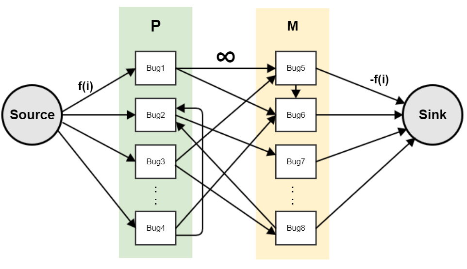
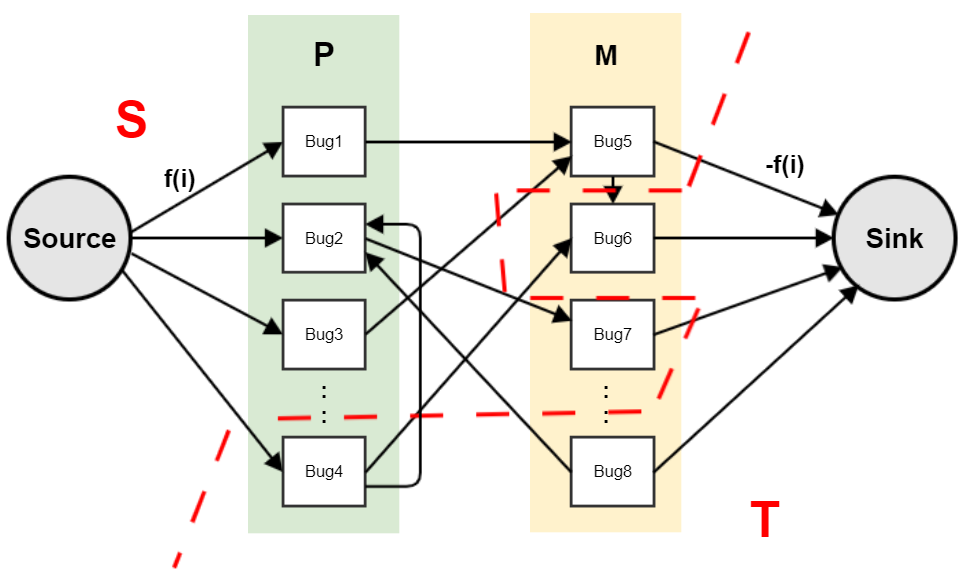

# Description
One of your hobbies is to fix bugs in a well-known open source SDK, called the "Le Grate SDK" (aka LG SDK).

Recently, a lot of bugs were discovered, and because of their relationship, you are now solving a fun problem.

There are currently n known bugs (labeled as 1 to n), and you quantified how fun it will be to fix each bug -- the fun score.

Specifically, if you fix bug i, then you will have f[i] units of fun which is either a positive integer or a negative integer (if it's negative, then you think it'll be boring for you to fix the bug).

If you can only fix the bugs with positive fun scores, but you also realized that some bugs require other bugs also be fixed.

That is, there are cases where you must fix bug j first in order to fix bug i.

For instance, suppose that n = 3 and your fun scores are f1 = 5, f2 = -2, and f3 = 3.

To fix bug 1, you must also fix bug 2, and to fix bug 2, you do not have to fix any other bugs. Lastly, to fix bug 3, you must also fix both bugs 1 and 2.

In this case, if you only fix bug 2, then your overall fun score will be -2, whereas if you fix both bugs 1 and 2 then the overall fun score will be 3.

Lastly, if you fix all three bugs, then the overall fun score will be 6.

Given the number of bugs, their fun scores, and their relationships, find the maximum overall fun score you can achieve.

## Input
The first line will contain the number of test cases, T.

For each test case, the first line will contain the number of bugs, n.

The second line will contain n integers, separated by a whitespace, that describe fun scores of the bugs.

The following n lines will contain one or more integers.

The i-th line's first integer will describe the number of other bugs that must be fixed in order to fix bug i.

If xi is that number, then xi integers will follow (and be separated by a whitespace).

These xi bugs will be distinct.

## Output
For each test, you must output the maximum achievable overall fun score in a single line.

## Limit
```
1 ≤ T ≤ 10
2 ≤ n ≤ 500
1 ≤ |fi| ≤ 1,000,000
0 ≤ xi ≤ min(300, n-1)
```
## Subtask 1 (6 Points)
1 ≤ n ≤ 20
## Subtask 2 (21 Points)
1 ≤ n ≤ 500
## Sample Input 1
```
8
4
2 -3 6 -4
1 2
0
2 2 4
1 2
3
2 -6 3
0
0
2 1 2
3
5 -2 3
1 2
0
2 1 2
3
-2 -3 -4
0
0
0
3
1 -1 2
1 2
1 3
1 1
6
-51 -89 -58 21 -6 35
0
4 1 4 3 5
2 4 6
1 1
4 1 4 6 3
1 1
5
-10 -10 -10 -10 39
0
0
0
0
4 1 2 3 4
7
72 96 -45 -69 -46 65 -70
0
1 1
2 1 2
3 1 2 3
2 1 2
4 1 2 3 5
2 3 5
```
## Sample Output 1
```
1
2
6
0
2
5
0
168
```
## Explanation of Sample results
- Test case 1: If you fix all bugs, the overall fun score will be 1. You can't just fix bug 1 (which requires fixing bug 2), and fixing bugs 1 and 2 yields fun score of -1. To fix bug 3, you must also fix bugs 2 and 4 (which leads to fun score of -1), and if you also fix bug 1 then the overall score will be 1.  This is optimal.
- Test case 2: If you fix all bugs, the overall fun score will be -1. If you only fix bug 1 alone, then the fun score will be 2. To fix bug 3, you must also fix bugs 1 and 2, which results in fun score of -1.
- Test case 3: This was discussed in the problem statement.
- Test case 4: Every bug's fun score is negative, and thus not fixing any bugs would be optimal.
- Test case 5: Bug 1 requires fixing bug 2, which requires fixing bug 3, which in turn requires fixing bug 1. This is a valid case, and you simply need to fix all three bugs or none.  If you choose to do the former, then overall score will be 2.
- Test case 6: Fixing bugs 1, 4, and 6 results in the overall score of (-51) + 21 + 35 = 5. Note that both bug 4 and bug 6 require bug 1 to be fixed as well.
- Test case 7: Bug 5 is the only one with positive score, but it requires other bugs be fixed (in which case, the overall score becomes negative). Hence, it's better to fix nothing.
- Test case 8: The optimal solution is to fix bugs 1 and 2, with overall score 168.

# Solution:

When bugs with positive or negative interests have a dependent relationship with each other, it's problem of choosing bugs for maximum interest. Bugs with positive interest can be seen as a benefit to maximum interest, and bugs with negative interest can be seen as a cost to become maximum interest.

Configuration of flow network
This flow network consists of a set P of positive bug, a set M of negative bug, and Source and Sink.

Connect the edges with capacity f[i] from the source to nodes that belong to P. And connect the edges with capacity -f[i] from nodes that belong to M to the sink.

Finally, connect the edges that connect the nodes in the dependent relationship.



**Solving with Min-Cut Algorithm**

We will use the min-cut algorithm to find relationships with maximum interest in this network.

First, divide the nodes in this network into cut S and T. The nodes in the cut S are the bugs we select, the nodes in the cut T are the bugs we don't select.



When the capacity of the cut is C, the line from S to T is always the line from Source to P that belong to T, or the line from M that belong to S to Sink.

`C =  Sum of f(i) (that i  belongs both T and P) + Sum of -f(i) (that i  belongs both S and M)`

that is,

`C = Sum of positive interests among unselected bugs - Sum of negative interests among selected bugs`

You can define the maximum interest X as follows.

`X =  Sum of positive interests among selected bugs + Sum of negative interests among selected bugs`

When you add C and X, the terms (the sum of the negative interests of the selected bugs) are deleted and you can found follows.

`C + X = Sum of positive interests among unselected bugs + Sum of positive interests among selected bugs =  Sum of positive interests of all bugs`

`C + X is the value given and unchanged by the problem because it is sum of positive interests of all bugs.`

Therefore, for `X` to be the maximum value, `C` must be the minimum value.

So when the cut we divided earlier becomes min-cut, you can get the maximum interest.

Since min-cut's capacity is equal to the maximum flow, the answer can be obtained by calculating `C` with the maximum flow algorithm and subtracting it from the sum of the total positive interest.

`X = sum of all positive interests - C`

