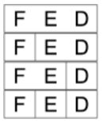

# Description

Consider splitting a string S of length n into k substrings, T1, T2, ..., Tk, according to the rules below:

* 1 ≤ k ≤ n
* For each i with 1 ≤ i ≤ k, Ti must be a substring of S with length at least 1 (that is, Ti must consist of consecutive character(s) in S).
* If you concatenate T1, T2, ..., Tk in this order, it results in the original string S.

For instance, if S = "FED", then we can split it into four different ways as follows:

* Option 1: T1 = "FED" (in this case, k = 1)
* Option 2: T1 = "F", T2 = "ED" (in this case, k = 2)
* Option 3: T1 = "FE", T2 = "D" (in this case, k = 2)
* Option 4: T1 = "F", T2 = "E", T3 = "D" (in this case, k = 3)

For your information, there are 2^(n-1) ways to split a string of length n according to the rules above.

In this problem, we assume that S is a hexadecimal string that only consists of '0'-'9' and 'A'-'F'.

Albert wants to know in how many ways he can split S into T1, T2, ..., Tk such that the substrings form a non-decreasing sequence.
Formally, Albert wants to ensure that T1 ≤ T2 ≤ ... ≤ Tk is satisfied if each substring is interpreted as a hexadecimal number.

In the example above, those four options lead to the following sequences:

* Option 1: [FED(16) = 4077] (a non-decreasing sequence)
* Option 2: [F(16) = 15, ED(16) = 237] (a non-decreasing sequence)
* Option 3: [FE(16) = 254, D(16) = 13]
* Option 4: [F(16) = 15, E(16) = 14, D(16) = 13]



In this case, the first two options lead to non-decreasing sequences, so the answer will be 2.

In another example where S = "0070", there are four ways to obtain non-decreasing sequences.

* Option 1: T1 = "0070"
* Option 2: T1 = "0", T2 = "0", T3 = "70" (in this case, the sequence is [0, 0, 70(16) = 112])
* Option 3: T1 = "00", T2 = "70"
* Option 4: T1 = "0", T2 = "070"

As you can see in option 1, option 3, and option 4, substrings are allowed to contain leading zero(s).

Given a hexadecimal string S, compute the number of ways in which Albert can split S into substrings such that the resulting sequence is a non-decreasing sequence.

* **Input**
The first line of the input will contain a single number, T, the number of test cases.

In each of the following T lines, an input string S will be given.

S will only consist of 0-9 (digits) and A-F (uppercase) that are used in hexadecimal numbers.
* **Output**
For each test case, output the answer in a single line.

* **Limit**
```
1 ≤ T ≤ 20
1 ≤ n ≤ 15
S will consist only of 0-9 and A-F.
```
* **Sample Input**
```
4
0070
FED
42
002021
```
* **Sample Output**
```
4
2
1
12
```

Case 1: Discussed in the problem statement.

Case 2: Discussed in the problem statement.

Case 3: [42] is the only way.

Case 4: No explanation provided.

# Solution:
The binary number additions without carries is the same as the Bitwise-XOR operation.

`Bitwise-XOR Truth Table`
```
0	0	1
1	1	0
```
Through the characteristics of the Bitwise-XOR operation,

When A and B are set, we know that X is the only one that satisfies A ^ X = B.
X can be calculated as X = A^B.
This means that the value of V[i] determines the value of V[j] that satisfies the condition(V[i] ^ V[j] = S(i, j) =  X) and can be calculated in advance.
