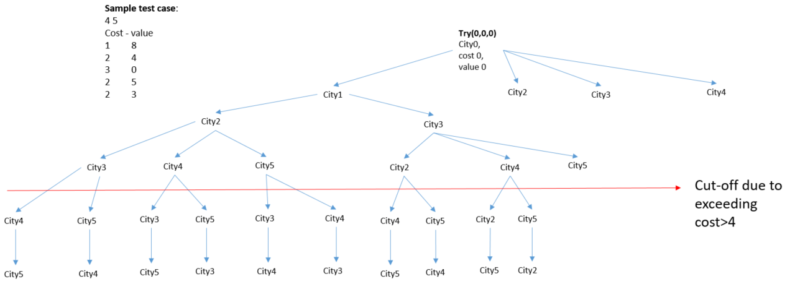

# Description:
Given `n` cities, and `cost[i]` to store a cost to visit city `i`, and `value[i]` to store value earn from visiting a city `i`. Find the path to visit cities such that we get the most value while running only `c` cost.

# Solution 1: Brute Force - Backtracking
* *Note*: problem is only do-able with small `n<30`
* use backtracking to generate all possible cases. The traversing on all those cases are limited by the cost of visiting the city.

For example: With 5 cities whose cost and values are provided, the possible cases are: 
## Algorithm
## Complexity:
* O(N^N)

# Solution 2: Brute Force - Backtracking - Optimization with Branch and Bound Technique
* Optimization for backtracking aim to reduce the number of backtracking steps. One strategy to do this is to know check if it is worthy to continue the backtracking steps for remaining candidates.
    1. Basic stop condition: when the cost of visiting the city exceed the cost requirement, stop backtracking.
    2. Optimizing stop condition: check if it is worth visiting the remaining cities if the earning values would not exceed the max value gained so far.
## Algorithm:
* Reference: https://www.youtube.com/watch?v=yV1d-b_NeK8 and https://codecrucks.com/knapsack-problem-using-branch-and-bound/
* Code template:
```
void init() {
    Step 1: create a BEST_CONFIG result;
}

void try(int i) {
    for (v : {tập giá trị có thể cho x[i]) {
        x[i] = v;
        if (the next item can return better result than BEST_CONFIG) {        // Step 2: check condition to continue to next item
            if (i == k) { //Nếu i là phần tử cuối cùng trong cấu hình         // Step 3: check stop condition: if the item is the last
                // Step 3: update BEST_CONFIG;
            }
            else {
                // Step 4: mark the items as visited/unvisited and run backtracking
                mark[v] = true;
                try(i+1);
                mark[v] = false;
            }
        }
    }
}
```
* Step1: BEST_CONFIG:
* Step2:
## Complexity:
* O(2^N)