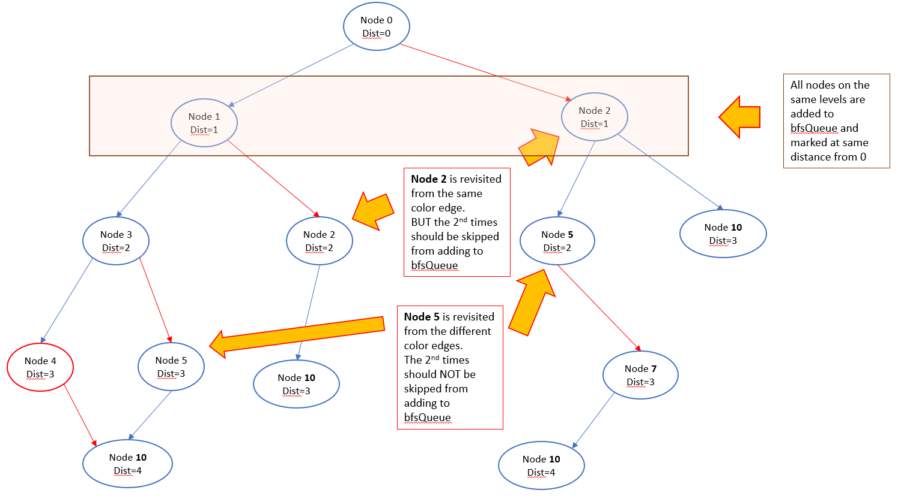

# Description:
You are given an integer `n`, the number of nodes in a *directed graph* where the nodes are labeled from `0` to `n - 1`. Each edge is `red` or `blue` in this graph, and there could be `self-edges` and `parallel edges`.

You are given two arrays `redEdges` and `blueEdges` where:

* `redEdges[i] = [ai, bi]` indicates that there is a directed `red edge` from node `ai` to node `bi` in the graph, and
* `blueEdges[j] = [uj, vj]` indicates that there is a directed `blue edge` from node `uj` to node `vj` in the graph.
  
Return an array answer of length `n`, where each `answer[x]` is the length of the shortest path from `node 0` to `node x` such that the edge colors alternate along the path, or `-1` if such a path does not exist.

## Example 1:
```
Input: n = 3, redEdges = [[0,1],[1,2]], blueEdges = []
Output: [0,1,-1]
```

## Example 2:
```
Input: n = 3, redEdges = [[0,1]], blueEdges = [[2,1]]
Output: [0,1,-1]
```

# Solution: BFS 
## Problem analysis: 
* special case: the path from node 0 to itself is 0.
* starting node is `0`. From there, the path can take either red or blue edge.
* a node could be revited TWICE , if the edge is different

  * example 1: 
```
n=4
red edges: [[0,1],[1,2],[2,3],[3,4]]  
blue edges: [[1,2],[2,3],[3,1]]    

0->1R->2B->3R->1B->2R->3B->4R
node 2 is visited twice
```
  * example 2: Consider the following data set.
```
11
[[0,2],[1,2],[3,6],[4,10],[5,7]]
[[0,1],[1,3],[3,4],[6,10],[2,5],[7,10]]

node 2 could be visited twice on the same color edge, but we shouldn't add it to bfsQueue.
node 5 is visited twice from 2 different color edges, the paths unique, and we should add it to bfsQueue.
```
 

## Algorithm
* run multiple BFS to find shortest path from node 0 to every other node.
* create a struct to store the properties of a node:
  ```
  struct Node{
        int node;               // node       
        int edge;               // connecting edge, 0: red, 1: blue, identified by redEdges, blueEdges
        int distance=0;         // distance from node 0
    };
  ```
* `2vector (row:nodes, col: neighbors of nodes)` stores neighbor nodes as values to a node.
* each BFS run will find shortest path from node zero to node i=1 --> i=n-1
  * a single bfsQueue stores `all neighbors` on both redEdges and blueEdges to queue.
    * the specific neighbors of current node to be added will depends on the `edge color` of current nodes, and if it has been visited from the same edge color before.
  ```
  // process neighbor:
  for (auto next : neighborList[curr.node]){
      if ((curr.edge == -1 || curr.edge == 1) and 
            next.edge == 0 and 
            visitedRed[next.node] == true){           // next node must be on red edge, and node was visited 
          // cout<<"     "<<next.node<<" visited on edge"<<next.edge<<endl;
          continue;
      }
      if ((curr.edge == -1 || curr.edge == 0) and 
            next.edge == 1 and 
            visitedBlue[next.node] == true){         // next node must be on blue edge, and node was visited 
          // cout<<"     "<<next.node<<" visited on edge"<<next.edge<<endl;
          continue;
      }    
      if ((curr.edge == -1 || curr.edge == 0) and visitedBlue[next.node] == false){
          if (next.edge == 1){                                   // change color edge for next's next edge
              next.distance = curr.distance + 1;
              // cout<<"       next "<<next.node<<" dist "<<next.distance<<" edge "<<next.edge<<endl;
              bfsQueue.push(next);
          }
      }
      if ((curr.edge == -1 || curr.edge == 1) and visitedRed[next.node] == false){
          if (next.edge == 0){
              next.distance = curr.distance + 1;
              // cout<<"       next "<<next.node<<" dist "<<next.distance<<" edge "<<next.edge<<endl;
              bfsQueue.push(next);
          }
      }
  }
  ```
  * bfsQueue marks all neighbors on the same level with the same values and depends on the current nodes.
  ```
  next.distance = curr.distance + 1;
  ``` 
  