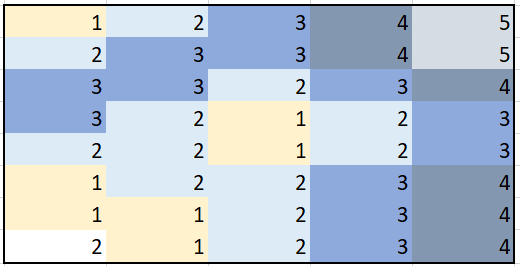

# Description:

Given an n x n grid containing only values 0 and 1, where 0 represents water and 1 represents land, find a water cell such that its distance to the nearest land cell is maximized, and return the distance. If no land or water exists in the grid, return -1.

The distance used in this problem is the Manhattan distance: the distance between two cells (x0, y0) and (x1, y1) is |x0 - x1| + |y0 - y1|.

* **Example 1:**

```
Input: grid = [[1,0,1],[0,0,0],[1,0,1]]
Output: 2
Explanation: The cell (1, 1) is as far as possible from all the land with distance 2.
```

* **Example 2:**

```
Input: grid = [[1,0,0],[0,0,0],[0,0,0]]
Output: 4
Explanation: The cell (2, 2) is as far as possible from all the land with distance 4.
```

* **Constraints:**
```
n == grid.length
n == grid[i].length
1 <= n <= 100
grid[i][j] is 0 or 1
```

# Solution 1: BFS + DP:

* BFS allows travesing from one cell to immediate neighbors. 
* If the cells are marked with values 1, 2, 3, ..., we could visualized how cells are visited. 

For example: The following shows how cells around the starting cell at {0,0} are reached 

* We find all cells that are marked as `land`, and pushed to `BFS queue`. 
* Run BFS to find neighboring cells to `land cells` such that the iteration goes from near land cells to far cells. Mark the cells as `2, 3, 4, ...`

  
For example: The following shows how cells around the land cells are marked until the farthest `sea cell` is found. 
