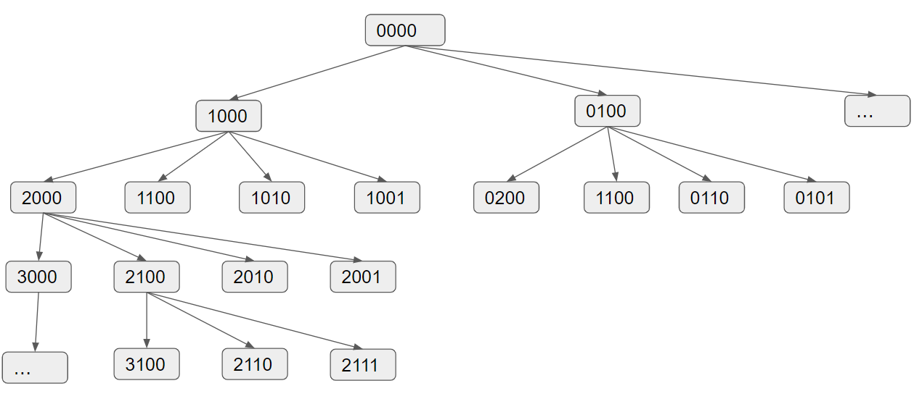

# Description:
You have a lock in front of you with 4 circular wheels. Each wheel has 10 slots: '0', '1', '2', '3', '4', '5', '6', '7', '8', '9'. The wheels can rotate freely and wrap around: for example we can turn '9' to be '0', or '0' to be '9'. Each move consists of turning one wheel one slot.

The lock initially starts at '0000', a string representing the state of the 4 wheels.

You are given a list of deadends dead ends, meaning if the lock displays any of these codes, the wheels of the lock will stop turning and you will be unable to open it.

Given a target representing the value of the wheels that will unlock the lock, return the minimum total number of turns required to open the lock, or -1 if it is impossible.

## Example 1:
```
Input: deadends = ["0201","0101","0102","1212","2002"], target = "0202"
Output: 6
Explanation: 
A sequence of valid moves would be "0000" -> "1000" -> "1100" -> "1200" -> "1201" -> "1202" -> "0202".
Note that a sequence like "0000" -> "0001" -> "0002" -> "0102" -> "0202" would be invalid,
because the wheels of the lock become stuck after the display becomes the dead end "0102".
```

## Example 2:
```
Input: deadends = ["8888"], target = "0009"
Output: 1
Explanation: We can turn the last wheel in reverse to move from "0000" -> "0009".
```

## Example 3:
```
Input: deadends = ["8887","8889","8878","8898","8788","8988","7888","9888"], target = "8888"
Output: -1
Explanation: We cannot reach the target without getting stuck.
``` 

## Constraints:
```
1 <= deadends.length <= 500
deadends[i].length == 4
target.length == 4
target will not be in the list deadends.
target and deadends[i] consist of digits only.
```

# Solution 1: BFS - level order traversal
## Problem Analysis:

* all possible turns could be generated by DFS, BFS, where each node is the result of each turn. Since the problem ask for the `minTurn`, it is better to use BFS. (as similar to shortest path problem)
* Each wheel could only roll by 1 value, and any wheel could be rolled in a turn: 
    * a level in the graph = turn count.
    * all nodes in the same levels have the same turn count
* Is there case for `roll-backward`? YES
    * starting from `0000`, `roll-forward`, the clock combination follows a graph like below: 
    * starting from `0000`, `roll-backward`, the clock combination follows a graph like below: 
* note that the number of turns are the *depth* of the graph
* Special cases: 
    * if `0000` is in the `deadends`, ans = -1.
## Algorithm:
1. Run a single BFS:
    * **level order traversal**: 
        * push `0000` to `bfsQueue`
        * at each level: save the level size
        * at each level: push in all the nodes in, then process the neighbor, and then pop out all the nodes at the same levels; 
        * turn count is incremented after each level, when all node at the same level have been popped.
        ```
        bfsQueue.push("0000");
        while (!bfsQueue.empty()){
            // n stores the number of nodes at the same level
            int n = bfsQueue.size();
            //  add and process all nodes at the same level to of the graph
            for (int i = 0; i<n; i++){
                string curr = bfsQueue.top();
                bfsQueue.pop();
                // process neighbors, add neighbor to queue
                
            }
            turn++;                 // increment turn count after all nodes at the same level have been popped out of bfsQueue           
        }
        ```
    * *Construct graph*:
        * node: string that represents the lock's combination. 
        * neighbor: 
            * string next = generateNextLock(curr);  create generateNextLock(curr) function to make next lock combination.
            * if next if found in `deadends`, don't add next to queue
    * return `turn[curr]` if `curr == target`
    * if bfsQueue is empty, return -1; 
    
2. make generateNextLock(curr) function:
    * loop through 4 wheels, where index of wheels `i` is also index of characters in the lock combination.
    * use assignment to change value of the lock combination when turning each wheel
        * forward turn: `next[i] = next[i] + 1` where is the index   
        * backward turn: `next[i] = next[i] - 1`
        * backward turn is used if `10 - target[i] < target[i]`     
    
