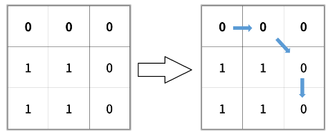

# Description:
Given an `n x n` binary matrix grid, return the length of the shortest clear path in the matrix. If there is no clear path, return -1.

A clear path in a binary matrix is a path from the top-left cell (i.e., (0, 0)) to the bottom-right cell (i.e., (n - 1, n - 1)) such that:

* All the visited cells of the path are 0.
* All the adjacent cells of the path are **8-directionally connected** (i.e., they are different and they share an edge or a corner).
* The length of a clear path is the number of visited cells of this path.

* Example 1:

```
Input: grid = [[0,1],[1,0]]
Output: 2
```

* Example 2:
 
```
Input: grid = [[0,0,0],[1,1,0],[1,1,0]]
Output: 4
```

# Solution: BFS with queue
* Note: special case when `grid[0][0]==1` there is no path, return -1 immediately.
* Run BFS to find path:
    * mark starting cell as `1`
    * counting the path is similar to `flood fill`: all *nearest* neighbor cells are marked with value: `1 + currentCell`
    * stop condition:
        * when the destination cell is reached, return the value of currentCell which is also the couting of the path.
        * if the queue is empty: there is no path, return -1.
