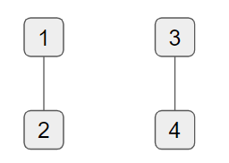

# Description:
There is an undirected graph with `n` nodes, where each node is numbered between `0` and `n - 1`. You are given a 2D array graph, where `graph[u]` is an array of nodes that `node u` is adjacent to. More formally, for each v in graph[u], there is an undirected edge between `node u` and `node v`. The graph has the following properties:

* There are no self-edges (graph[u] does not contain u).
* There are no parallel edges (graph[u] does not contain duplicate values).
* If v is in graph[u], then u is in graph[v] (the graph is undirected).
* The graph may not be connected, meaning there may be two nodes u and v such that there is no path between them.

A graph is bipartite if the nodes can be partitioned into two independent sets A and B such that every edge in the graph connects a node in set A and a node in set B.

Return `true` if and only if it is bipartite.\

# Solution: DFS
## Problem Analysis
* Ans = `false` if there is a node such that an adj node is marked on the same group with it. 
* Is there a single `nodeA` connected to multiple nodes? YES! 
    * all nodes connected the `nodeA` must be on the opponent group of nodeA's (bfs or dfs are both suitable)
* there are nodes that are not connected to other nodes, can those node be placed in a set? YES, they can be in any set and the graph is still bipartite.
    * return `true` as default for any current node in dfs process, if dfsStack is empty. 
* Are there disconnected subgraphs? YES, and nodes in disconnected subgraphs could still be in set A, set B.
    * must run multiple DFS(nodeA) to traverse all nodes connected to `nodeA`.
    * each dfs traverses and marks the nodes in the "subgraph".

For example: The following has 2 subgraphs that are disconnected.  

