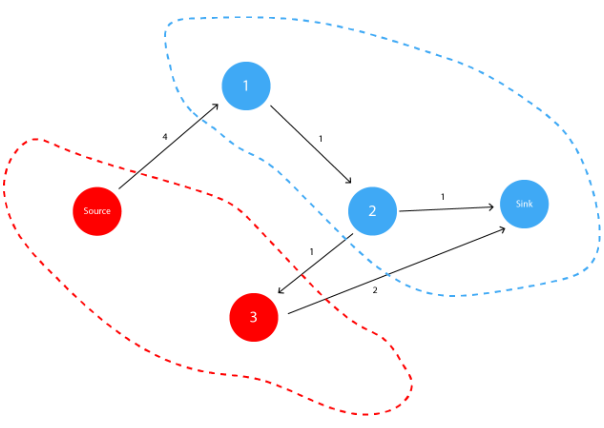
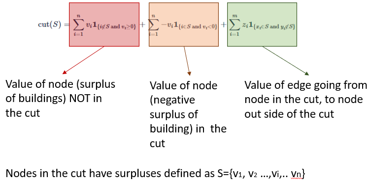
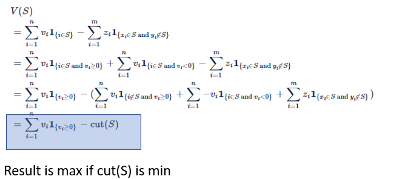
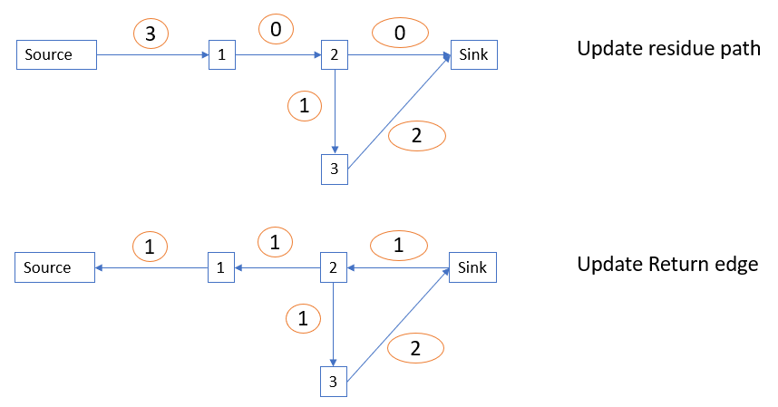

# Description:

Bob lives in the city of Alberta with n buildings (numbered 1 to n for convenience). Each building produces and consumes certain amount of electricity. For each i, let v[i] be the "surplus" of the i-th building, the difference between the amount of its electric production and consumption. In case the consumption is greater than the production, v[i] will be negative (for this problem, we do not consider the case of v[i] being 0).

Some buildings are connected by power lines, enabling a building to send electricity to other building(s). There exist m power lines (numbered from 1 to m), and the j-th power line sends the positive amount z[j] of electricity from the building x[j] to the building y[j]. Each power line is directed, that is, it has the origin and destination, and at most one power line exists from one building to another.

Electricity is a critical resource, and Bob wants to buy some of these n buildings to maximize the "overall surplus" of electricity from these buildings. Specifically, let S be a subset of {1, 2, ..., n} (that is, Bob buys the buildings in S), and we define V(S), the overall surplus of S, as follows:

V(S) := "(Sum of the surpluses of the buildings in S) - (Sum of electricity sent from the buildings in S to the buildings not in S through the power lines)"
Suppose n = 3, m = 2, v = [4, -1, -2], x = [1, 2], y = [2, 3], and z = [1, 1].

Building 1's surplus is 4 and the other two buildings have negative surpluses.
Power line 1 sends one unit of electricity from the building 1 to the building 2.
Power line 2 sends one unit of electricity from the building 2 to the building 3.
In this example, there are 23 = 8 different ways to purchase buildings (Bob may buy 0 or n buildings), and the following shows the overall surplus for each case:

When S is empty: V(S) = 0.
When S = {1}: V(S) = 4 - 1 = 3.
When S = {2}: V(S) = (-1) - 1 = -2.
When S = {3}: V(S) = (-2) - 0 = -2.
When S = {1, 2}: V(S) = (4-1) - 1 = 2. (In this case, the power line 1 sends electricity from the building 1 to the building 2. By the definition above, however, this does not count towards V(S).)
When S = {2, 3}: V(S) = (-1-2) - 0 = -3.
When S = {1, 3}: V(S) = (4-2) - 1 = 1.
When S = {1, 2, 3}: V(S) = (4-1-2) - 0 = 1.
The maximum of V(S) is achieved with S = {1}.

Now suppose n = 2, m = 1, v = [1, -5], x = [1], y = [2], and z = [1].

When S is empty: V(S) = 0.
When S = {1}: V(S) = 1 - 1 = 0.
When S = {2}: V(S) = -5.
When S = {1, 2}: V(S) = (1-5) - 0 = -4.
The maximum of V(S) is achieved when S is {1} or empty.

Given n, m, v, x, y, and z, compute the maximum V(S) that Bob can achieve.

* **Input**
The first line of the input will contain T, the number of test cases.

The first line of each test case will contain n and m, separated by whitespace.

The second line will contain buildings' surpluses (v[i]'s), separated by whitespace.

The next m lines will contain three integers x[j], y[j], and z[j], indicating that a power line sends z[j] units of electricity from x[j] to y[j].

* **Output**

Output each test case's answer in each separate line.

* **Subtask1**
```
1 ≤ T ≤ 20
2 ≤ n ≤ 15
1 ≤ m ≤ min(100, n*(n-1))
For all i with 1 ≤ i ≤ n, 1 ≤ | v[i] | ≤ 100,000
For all j with 1 ≤ j ≤ m, x[j] ≠ y[j] and 1 ≤ x[j], y[j] ≤ n and 1 ≤ z[i] ≤ 100,000
For all j, k with 1 ≤ j < k ≤ m, x[j] = x[k] and y[j] = y[k] will not occur (that is, oriented power lines are distinct)
```
* **Subtask2** 
```
1 ≤ T ≤ 20
2 ≤ n ≤ 200
1 ≤ m ≤ min(8000, n*(n-1))
For all i with 1 ≤ i ≤ n, 1 ≤ | v[i] | ≤ 100,000
For all j with 1 ≤ j ≤ m, x[j] ≠ y[j] and 1 ≤ x[j], y[j] ≤ n and 1 ≤ z[i] ≤ 100,000
For all j, k with 1 ≤ j < k ≤ m, x[j] = x[k] and y[j] = y[k] will not occur (that is, oriented power lines are distinct)
```

* **Sample Input 1**
```
6
2 1
1 -2
1 2 3
2 1
1 -2
2 1 3
3 2
4 -1 -2
1 2 1
2 3 1
3 6
10 10 10
1 2 2
2 1 3
1 3 4
3 1 5
2 3 6
3 2 7
2 1
1 -5
1 2 1
3 2
1 1 -2
1 3 1
2 3 1
```
* **Sample Input 2**
```
0
1
3
30
0
0
```

# Solution 2: use Edmond-Karp algorithm to find max flow from source to sink. 
Credit: solution provided by hoang.vu@lge.com 
1. Why is this problem a max flow, min cut problem? 
   * a graph could be draw where:
     * positive surplus V[i] is the value of connection between source and node.
     * negative surplus V[i] is the value of connection beetween sink and node.
     * `source` is defined as node `0`.
     * `sink` is defined as node `n+1`
   * the result is defined as: `V(S) = (Sum of the surpluses of the buildings in S) - (Sum of electricity sent from the buildings in S to the buildings not in S through the power lines)`
   * In other words, the result is: 
  
  

   * Cut definity is such that it separate the source from the sink. For example, the following is a cut: 
  
  

   * Mathematically, a flow of a cut is defined as : 
  
  

   * Using mathematical manipulation, we have: `result = total of positive surplus - minCut` 
2. How to solve this problem with Edmon_karp algorithm ? 
   * **Step 1**: use BFS to find shortest path from source to sink 
For example, with TC: v=[4, -1, -2],  connection[1][2]=1, connection[2][3]=2, after running BFS, we have: 
      - **Step 1.1**: add source to traversing queue.
      - **Step 1.2**: get `currentNode = queue.front()`, pop the traversing queue, mark it as visited.
      - **Step 1.3**: process the currentNode's neighboring relation.
        - we have source - node relation if V[i]> 0 ==> `connection[0][currentNode]= abs(V[i])`
        - we have node -sink relation if V[i]<0  ==> `connection[n-1][currentNode]= abs(V[i])`
        - other wise we have `connection[nodeX][nodeY]` be provided in the input. 
        - update the path from source to sink. 
      - **Step 1.4**:push the neighbor of currentNode to queue. Go back to step 1.1, continue until queue is empty
   * **Step 2**: along the found path, find the max flow or edges with minimum capacity. The add the edge capacity to `minCut/maxFlow` result.
    ```
    while (curr != source) {                                // search for the shortest capacity amoung the edges from source -> sink
            int par = parent[curr];
            fl = min(fl, conn[par][curr]);
            curr = par;
        }
    ret += fl;
    ```
   * **Step 3**: update the residue graph and return graph. 
    ```
    curr = sink;
    while (curr != source) {
            int par = parent[curr];
            conn[par][curr] -= fl;                              // update residual graph
            conn[curr][par] += fl;                              // update return edges
            curr = par;
        }
    ```
For example, with TC: v=[4, -1, -2],  connection[1][2]=1, connection[2][3]=2, after step 3, we have: 
   * **Step 4**: go back to step 1, run BFS on the `residue graph` to find the remaining shortest path from source to sink. Continue until there is *no path*

For example, with TC: v=[4, -1, -2],  connection[1][2]=1, connection[2][3]=2, after step 4, we have the loop terminated due to an edge on residue graph with value 0, and thus no path from source to sink is found: 